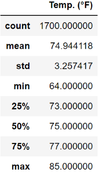
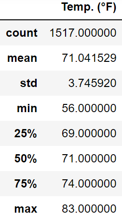

# Surfs_Up
Module 9 challenge

•••••••••••• Purpose of this analysis ••••••••••••

The purpose of this analysis was to perform a statistical comparison of the temperatures at this coastal location in Oahu for the months of June and December, to determine if this surf and ice cream shop business is sustainable year-round.

•••••••••••• Major points from the analysis ••••••••••••

• The analysis shows that average tempertures in June are warmer than December by 3.9° F. The average temperature for December is over 71° F so that is still quite warm.

• December temperatures show greater variability, as the standard deviation for December is greater (3.75 vs. 3.26) and the range between highest and lowest tempertures is greater (27° range in December vs. 21° range in June).

• For each month, the median temperature (75° F for June and 71° F for December) is almost the same as the average temperature for each month. This indicates that each month's data likely exhibits a normal distribution.

Below are data tables of summary statistical analysis for each of the two months:

       June (2010 - 2017)         December (2010-2016)

 
 

•••••••••••• Summary of the results with additional queries to perform ••••••••••••

Based on the initial analysis of these results, there is a high probabilty that this location would make a good location for the surf and ice cream shop. Average temperatures are warm with relatively low variability. Temperatures never approach freezing nor exceed 90° F.

However, these temperature results are based on only 7 or 8 years of data, for only two of of the 12 months of the year. This is a relatively short period of time, so the average values could be skewed if there were several abnormally cool, or abnormally warm, years during the period. Data should be collected over more years and should cover the entire year.

Data analysis should also include analysis of precipitation, cloud cover, number of rainy days, and other factors that may affect whether or not people would desire to surf. A location that is warm, but where it is frequently rainy, would not offer optimal weather conditions for surfing. This would be particularly true for casual surfers, who only surf on warm, sunny days and who likely be prime customers at a surf shop that also sells ice cream (I presume the most avid surfers likely surf in all kinds of weather conditions, so they are less affected by weather variability). 

Other types of data that should be analyzed could include average wind speed, water tempertures of the coastal waters, and average wave size and intensity. Surfers are more likely to be attracted to a location with larger and more consistent wave activity, and warmer water. Stronger winds would likely generate more intense wave activity as well.

In addition, if possible, it would be good to analyze a history of potential natural disasters that could destroy the shop, such as hurricanes and tsunamis. 
