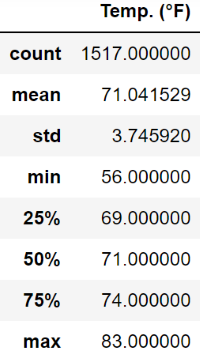

# Surfs_Up
Module 9 challenge

Explain the purpose of this analysis

The purpose of this analysis was to perform a statistical comparison of the temperatures at this coastal location in Oahu for the months of June and December, to determine if this surf and ice cream shop business is sustainable year-round.

Results: Provide a bulleted list with three major points from the two analysis deliverables. Use images as support where needed.

• The analysis shows that average tempertures in June are warmer than December by 3.9° F. The average temperature for December is over 71° F so that is still quite warm.

• December temperatures show greater variability, as the standard deviation for December is greater (3.75 vs. 3.26) and the range between highest and lowest tempertures are greater (27° range in December vs. 21° range in June).

• For each month, the median temperature (75° F for June and 71° F for December) is almost the same as the average temperature for each month. This indicates that each month's data likely exhibits a normal distribution.

Summary: Provide a high-level summary of the results and two additional queries that you would perform to gather more weather data for June and December.
Average Temperatures

       June (2010 - 2017)         December (2010-2016)

 
 
